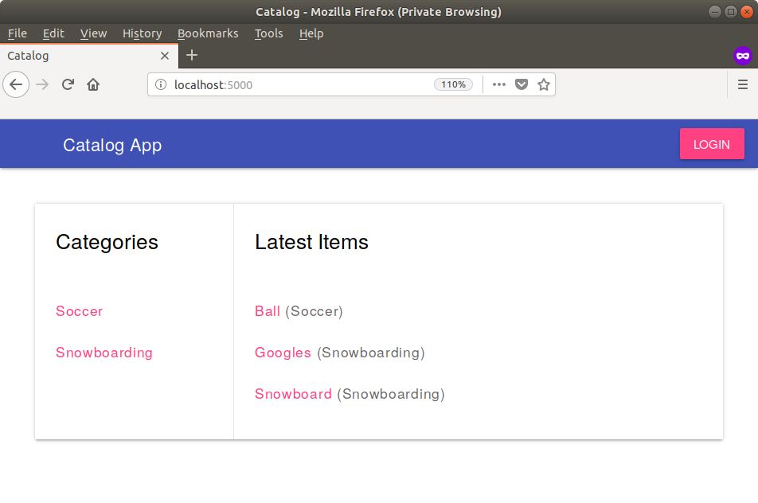

# Item Catalog

This is the third project of the *Udacity Fullstack Developer Nanodegree*.
The goal is to create a website which provides a list of items within a variety of categories as well as provide a user registration and authentication system. Registered users should have the ability to post, edit and delete their own items.

## Getting Started

These instructions will get you a copy of the project up and running on your local machine for development and testing purposes.

### Prerequisites

* VirtualBox: You can download it from the official site - [Oracle VM VirtualBox](https://www.virtualbox.org/wiki/Download_Old_Builds_5_1 "Oracle VM VirtualBox")
* Vagrant: You can download it from [vagrantup.com](https://www.vagrantup.com/downloads.html "Vagrant by HashiCorp")
* Pycodestyle (for code style tests): You can download it from the official [repository](https://github.com/PyCQA/pycodestyle "Python Style Checker") or using `pip install pycodestyle`

### Installing

Clone the `fullstack-nanodegree-vm` repo:

```
git clone https://github.com/udacity/fullstack-nanodegree-vm
```

Download the source code into the `vagrant` folder:

```
cd /vagrant
git clone https://github.com/henkeldi/fullstack-nanodegree-item-catalog.git
```

Build the vm image (this might take some minutes):

```
vagrant up
```

Log on to the virtual machine:

```
vagrant ssh
```

Setup the database:

```
cd /vagrant/fullstack-nanodegree-item-catalog
python create_database.py
```

### Running the program

```
cd /vagrant/fullstack-nanodegree-item-catalog
python project.py
```

Now navigate to `localhost:5000` on your local machine. It should look as shown below.



Moreover catalog item information can be accessed using the [REST API interface](doc/API.md).

## Running the tests

### Coding style tests

Checks the code against some of the style conventions in [PEP 8](https://www.python.org/dev/peps/pep-0008/ "PEP 8 -- Syle Guide for Python Code").

```
cd /vagrant/fullstack-nanodegree-item-catalog
pycodestyle *.py
```

## Authors

* **Dimitri Henkel** - *Initial work* - [henkeldi](https://github.com/henkeldi)

## License

This project is licensed under the MIT License - see the [LICENSE.md](LICENSE.md) file for details
